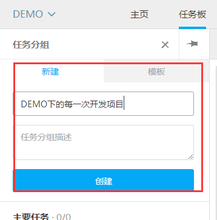
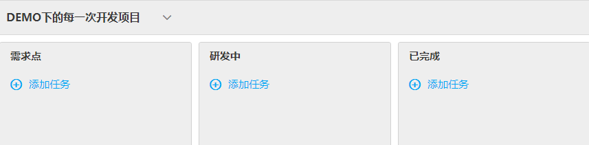
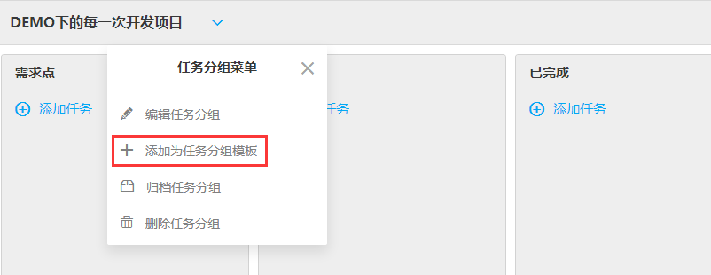
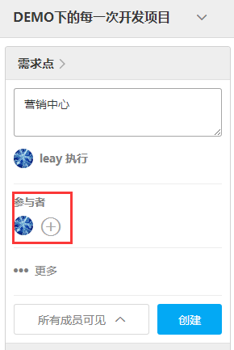
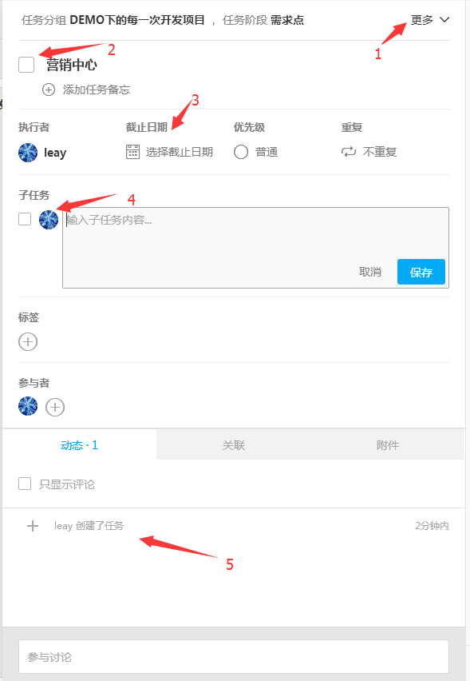
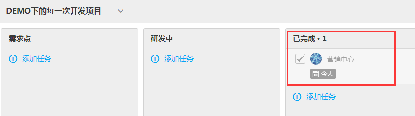

# TEAMBITION项目创建流程

[TEAMBITION](https://www.teambition.com/projects) 添加和新建项目时，请按照如下规范进行

### 创建项目 ###

**1、点击右上角创建项目**（为大项目，比如平台化）；

**2、创建任务分组**（该任务分组代表大项目下的每一个开发项目，相当于每次的开发分支，比如平台化项目这次开发任务为拆迁，那么此处填写拆迁，如果有任务模板，可以选择模板创建）；

**3、任务面板最后一列选择下拉框——选择切换至自由模式；**

**4、将任务列表编辑成如下图所示**（选择每列对应的下拉框可以编辑任务版的标题）；

**5、将已编辑的任务面板添加到模板中，方便下次直接使用；**

**6、添加任务功能模块并分配参与该任务的人员**（此处添加项目中功能模块，比如拆迁项目下有个模块叫营销中心）；

**7、点击任务右侧弹出详细编辑弹窗；**

1. 删除该任务等选项
2. 勾选后表示该任务完成
3. 选择该项任务需完成的截止日期
4. 添加功能模块下的功能点，如已完成该功能点请勾选（比如营销中心下面有：满送优惠券，满立减等一个个小模块）
5. 显示该任务所做的操作

**8、可以将每个任务拖到相应的流程阶段，如果已完成开发，将任务列表拖到已完成阶段，将任务勾选，表示已完成。如果没有逾期，算是正常开发完成**

**9、如果已经发布，将任务列表拖到“已发布”**

1. 如果未完成，将任务列表前面的勾点掉，拖到相应状态下，继续进行任务进度跟踪。
2. 进入测试阶段后走JIRA流程，每天打开JIRA看下自己的BUG。
